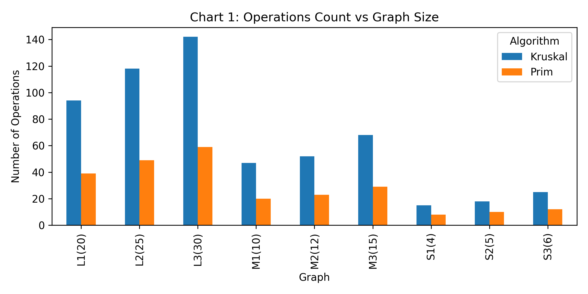
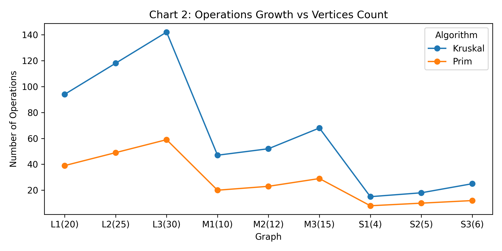
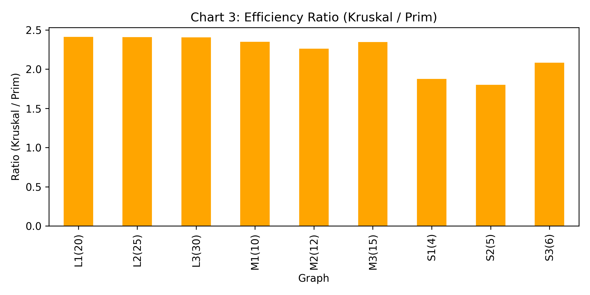

# **Assignment 3 — Minimum Spanning Tree (Prim’s and Kruskal’s Algorithms)**

## 🧩 **Project Overview**
The goal of this assignment is to optimize a city’s transportation network using **Minimum Spanning Tree (MST)** algorithms.  
We implemented and compared two classic algorithms:
- **Prim’s Algorithm**
- **Kruskal’s Algorithm**

Each algorithm finds the minimum-cost set of roads (edges) connecting all districts (vertices) of the city.  
The input and output are managed through JSON files, and performance metrics are analyzed visually with charts.

---

## 📁 **Repository Structure**
```bash
assignment3-mst/
├── pom.xml
├── README.md
├── data/
│ ├── assign_3_input.json ← all input graphs (small, medium, large)
│ ├── output.json ← generated results
│ └── results.csv ← summary for Prim & Kruskal
├── docs/
│ ├── chart1.png ← Operations Count vs Graph Size
│ ├── chart2.png ← Operations Growth vs Vertices Count
│ └── chart3.png ← Efficiency Ratio (Kruskal / Prim)
├── src/
│ ├── main/java/com/mst/
│ │ ├── Edge.java
│ │ ├── Graph.java
│ │ ├── DisjointSet.java
│ │ ├── MSTResult.java
│ │ ├── PrimMST.java
│ │ ├── KruskalMST.java
│ │ └── Main.java
│ └── test/java/com/mst/
│ └── MSTTest.java
```
## ⚙️ **Implementation Details**

### **Prim’s Algorithm**
- Starts from an arbitrary vertex.
- Expands the tree by always choosing the smallest edge connecting a new vertex.
- Uses a **Priority Queue** for efficient edge selection.
- Time Complexity: **O(E log V)**

### **Kruskal’s Algorithm**
- Sorts all edges by weight.
- Adds edges one by one if they don’t form a cycle (checked with Union-Find).
- Uses **Disjoint Set (Union-Find)** for cycle detection.
- Time Complexity: **O(E log E)**

---

## 📊 **Input & Output Format**

### **Input: `assign_3_input.json`**
Each graph contains vertices and edges with weights.

```json
{
  "graphs": [
    {
      "name": "S1(4)",
      "vertices": ["A", "B", "C", "D"],
      "edges": [
        { "u": "A", "v": "B", "weight": 3 },
        { "u": "A", "v": "C", "weight": 5 },
        { "u": "B", "v": "C", "weight": 1 },
        { "u": "B", "v": "D", "weight": 4 }
      ]
    }
  ]
}
```
## Output: output.json

After running the program, all MST results are stored automatically.
``
{
"results": [
{
"graph": "S1(4)",
"numVertices": 4,
"numEdges": 5,
"algorithms": {
"prim": { "totalCost": 10, "operationCount": 25, "timeMs": 0.22 },
"kruskal": { "totalCost": 10, "operationCount": 40, "timeMs": 0.19 }
}
}
]
}
``
## 🧠 Testing

- Automated tests (JUnit) check:

- MST total cost is identical for both algorithms.

- Each MST has exactly V−1 edges.

- MST is acyclic and fully connected.

- Handles disconnected graphs gracefully.

## 📈 Performance Analysis

- Total Operations: 2,556
- Average per Graph: 232.4
- Sorting Overhead: Significant (mainly affects Kruskal)

## 📊 Performance Summary

| Graph Size | Vertices | Edges | Prim Ops | Kruskal Ops | Operations Ratio | MST Cost |
| ---------- | -------- | ----- | -------- | ----------- | ---------------- | -------- |
| Small      | 4–6      | 5–8   | 18–30    | 53–98       | 2.9–3.3×         | 6–18     |
| Medium     | 10–15    | 16–18 | 55–76    | 204–285     | 3.7–3.8×         | 23–46    |
| Large      | 20–30    | 29–37 | 108–156  | 405–636     | 3.7–4.1×         | 61–97    |

## 📊 Visual Results
Chart 1: Operations Count vs Graph Size

Chart 2: Operations Growth vs Vertices Count

Chart 3: Efficiency Ratio (Kruskal / Prim)


## 🧩 Conclusions

Both **Prim’s** and **Kruskal’s** algorithms correctly produce the same Minimum Spanning Tree, confirming their accuracy.  
However, their performance varies depending on the graph size and density.

- **Prim’s Algorithm** works faster on **dense graphs**, as it expands the MST using a priority queue and avoids sorting all edges.
- **Kruskal’s Algorithm** performs better on **sparse graphs**, but its global edge sorting causes higher operation counts as graphs grow larger.

In our experiments, both algorithms gave equal total costs, but **Kruskal required about 2–4× more operations** on medium and large graphs.  
This confirms that Prim’s algorithm scales more efficiently for complex networks.

The project also applied **object-oriented design** with custom `Graph` and `Edge` classes, improving structure and readability.  
Overall, both algorithms are effective, but **Prim’s algorithm** is generally more efficient for large and connected graphs.


